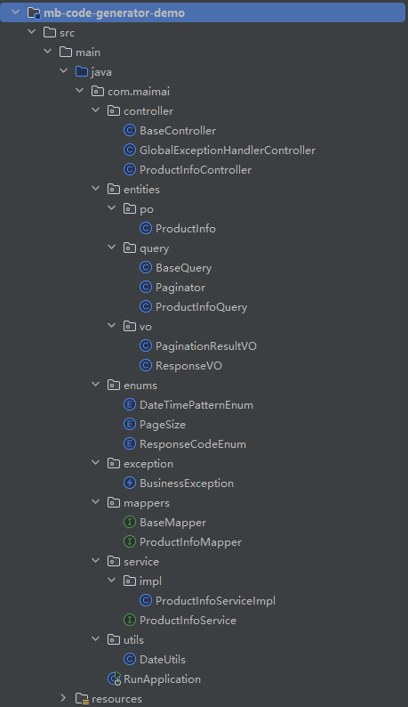
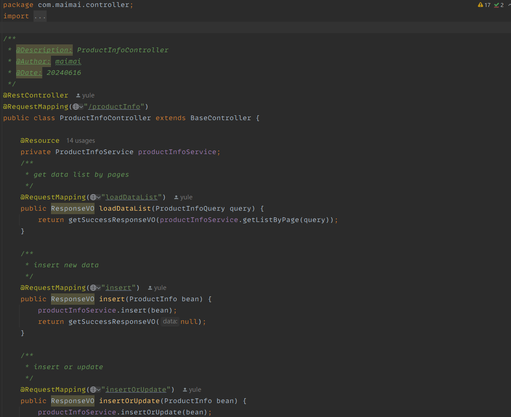
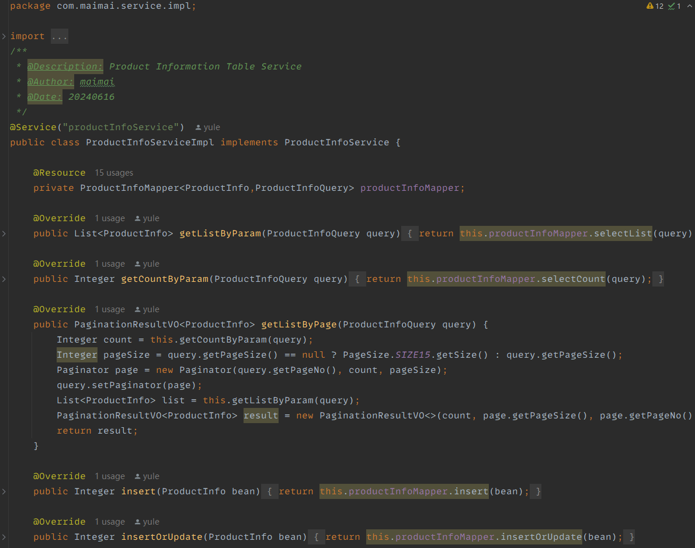
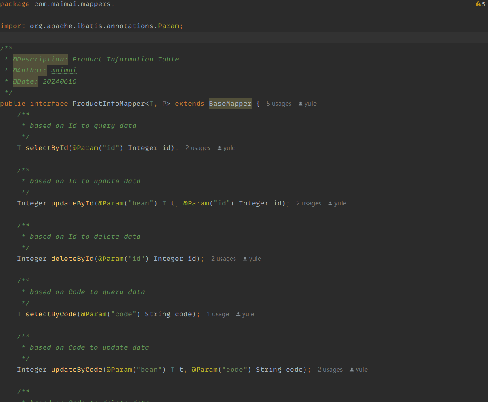
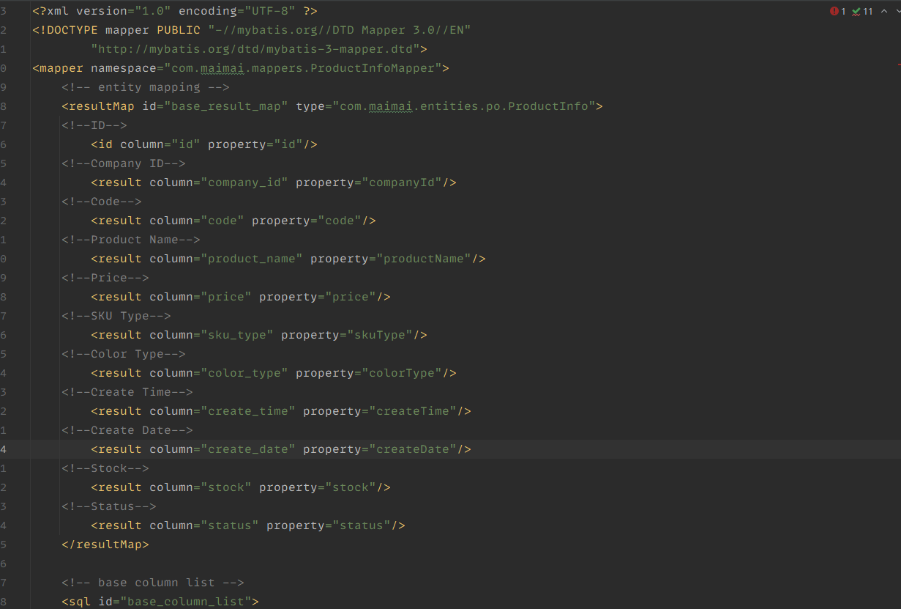

# MyBatis Code Generator

## Table of Contents
- [Project Description](#project-description)
- [Features](#features)
- [Installation](#installation)
- [Usage](#usage)
- [Configuration](#configuration)
- [Contributing](#contributing)
- [Contact](#contact)

## Project Description

MyBatis Code Generator is a Spring Boot tool designed to simplify the process of generating MySQL database and MyBatis-related codes, including controllers, services, service implementations, and mappers. This tool aims to reduce the repetitive tasks involved in setting up database interactions and CRUD operations, allowing developers to focus on core functionalities.







## Features

- Generate MySQL database schema
- Create MyBatis mappers
- Generate service interfaces and implementations
- Create RESTful controllers for CRUD operations
- Configuration-driven setup for easy customization

## Installation

### Prerequisites
- Java JDK 8 or higher
- Maven (optional, if using Maven for build)

### Clone the Repository
```sh
git clone https://github.com/your-username/mb-code-generator-workspace
cd mb-code-generator-workspace
```

## Usage
This repo contains a demo project, you can whether:<br>
a. use the demo to test the api directly or<br>
b. set up the configuration in mb-code-generator-workspace/mb-code-generator/src/main/resources/application.yml and run the application, it will automatically generate code for your project

## Configuration
Application properties inside mb-code-generator-workspace/mb-code-generator/src/main/resources/application.yml
```yml
server.port=8080
spring.datasource.url=jdbc:mysql://localhost:3306/your-database
spring.datasource.username=root
spring.datasource.password=your password
...
ignore:
  table:
    prefix: "true"
  bean:
    # support multiple json handle class
    tojson:
      field: your preferred field that needs to be ignored
      expression: your preferred Json ignore annotation (e.g. "@JsonIgnore")
      class: your preferred Json ignore package, don't forget to add the "import" keyword (e.g. import com.fasterxml.jackson.annotation.JsonIgnore)
...
bean:
  date:
    format:
      serialization: your preferred date serialization annotation (e.g. "@JsonFormat(pattern = \"%s\", timezone = \"GMT+2\")")
      serialization-class: your preferred date serialization package (e.g. com.fasterxml.jackson.annotation.JsonFormat)
      deserialization: your preferred date deserialization annotation (e.g. "@DateTimeFormat(pattern = \"%s\")")
      deserialization-class: your preferred date deserialization package (e.g. org.springframework.format.annotation.DateTimeFormat)
...
path:
  base: your project location (e.g. "D:/Coding/mb-code-generator-workspace/mb-code-generator-demo/src/main")
...
package:
  base: your package name (e.g. "com.maimai")
...
comment:
  author: author name
```


## Contributing
1. Fork the repository
2. Create a new branch (git checkout -b feature-branch)
3. Make your changes
4. Commit your changes (git commit -m 'Add some feature')
5. Push to the branch (git push origin feature-branch)
6. Open a Pull Request

## Contact
Mai Zhang: yulezh@proton.me<br>
Project Link: https://github.com/realmaimai/mb-code-generator-workspace
